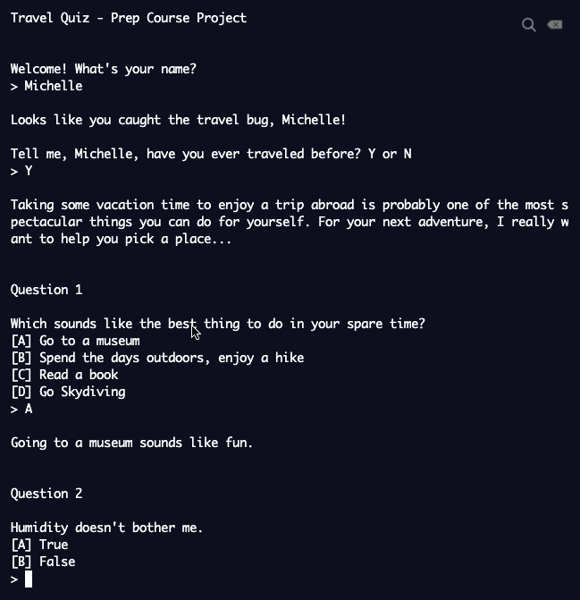

# Bei Viaggi

## About
Hackbright Academy - Prep Course Final Project - January 2020 

This was my first coding project and done purely in Python. Bei Viaggi is a virtual travel quiz where the user goes through a series of questions to receive a recommended travel destination. Feel free to clone/fork my travel quiz to try it out. Enjoy!

### Frontend User Experience

## Author 
**[Michelle Macaraeg](https://www.linkedin.com/in/macaraegm/)**

## Acknowledgments
* *Hackbright Instructor:* Katrina Huber-Juma

**Thank you for giving me the tools to succeed!**